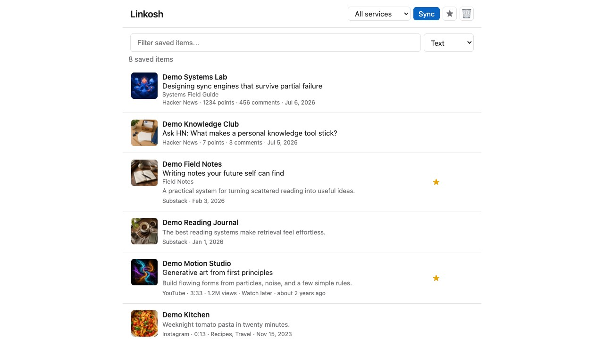
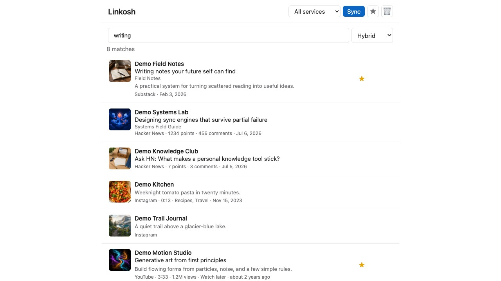
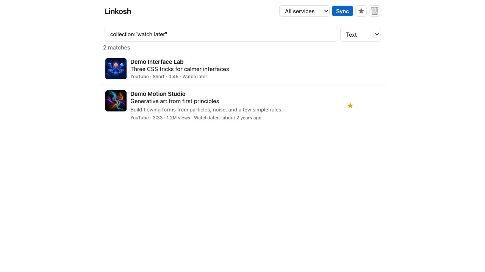
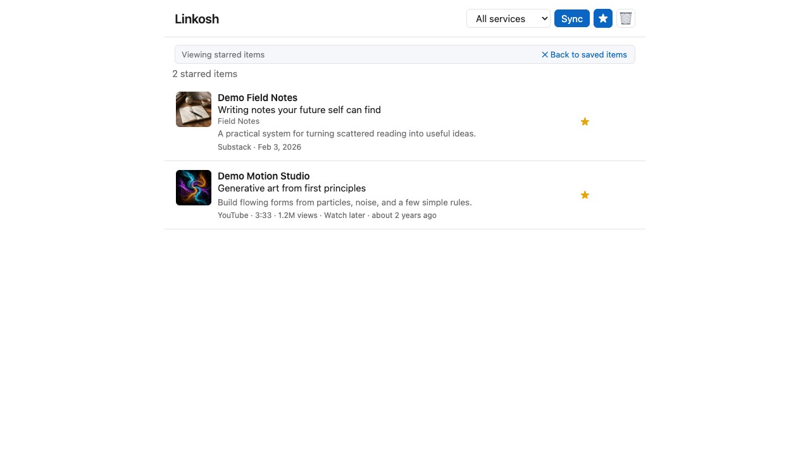
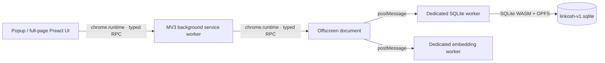

# Linkosh

Linkosh is a local-first Chrome extension that brings your saved items from
LinkedIn, Instagram, YouTube, Hacker News, X, Facebook, and Substack into one
searchable library.

Use it to:

- browse saved items from several services in one place;
- search by words, filters, or meaning;
- find items similar to something you already saved;
- star favorites and prune items you no longer want, with undo;
- keep an archive even after you unsave the original; and
- export the complete library as a SQLite database.

Linkosh is an early open-source project ([LGPL-licensed](#license)). It
currently needs to be installed from source, and its service integrations may
occasionally need maintenance as websites change their private APIs. If you
are comfortable trying a developer build, feedback and bug reports are very
welcome. Code contributions are not being accepted at the moment — see
[Contributing](#contributing).

## Screenshots

Browse saved items from every supported service in one library.



| Search by meaning | Filter with precise queries |
| --- | --- |
|  |  |

Star favorites and return to them in one click.



## Privacy at a glance

Linkosh is designed to work without a Linkosh account or server.

- Your library is stored in your browser, in a local SQLite database.
- Linkosh uses the sessions you already have open in Chrome. It does not ask
  for or store your passwords.
- Search embeddings are generated on your device. The model is downloaded once
  (about 34 MB) and then cached. Nothing is sent to any AI API.
- Raw responses from supported services are not archived unless you turn on
  the developer-only Capture mode.

Linkosh does need permission to access the supported websites so it can read
the same saved-item data their own pages use. See [Security and
limitations](#security-and-limitations) before installing.

## Supported services

| Service | What Linkosh imports |
| --- | --- |
| LinkedIn | Saved posts |
| Instagram | Saved posts and their collection names |
| YouTube | Watch Later and your playlists (Liked videos are excluded) |
| Hacker News | Upvoted stories and comments |
| X (Twitter) | Bookmarks |
| Facebook | Saved items and collection names |
| Substack | Saved posts, podcasts, and notes |

Linkosh keeps imported items as an archive. Removing an item on the original
service does not delete the copy in Linkosh; curating the library — starring
favorites, deleting clutter — happens in Linkosh itself.

## Install

There is no Chrome Web Store release yet. For now, install a prebuilt release
or build the extension from source. In either case, Chrome requires Developer
mode for an extension installed outside the Web Store.

### Install a prebuilt release

1. Download `linkosh-chrome-v*.zip` from the latest
   [GitHub release](https://github.com/sabyasachi/linkosh/releases/latest).
2. Extract the ZIP into a permanent folder named `linkosh-extension`. Chrome
   continues to use that exact folder after installation, so do not rename,
   move, or delete it.
3. Open `chrome://extensions` in Chrome.
4. Turn on **Developer mode** in the top-right corner.
5. Click **Load unpacked** and select the extracted folder.
6. Pin Linkosh from Chrome's Extensions menu if you want it to stay visible in
   the toolbar.

#### Update a prebuilt installation

Keep the permanent folder's path unchanged. A clean directory swap is safer
than copying over the old files because a release may remove files that were
present in an earlier build.

1. Use **Export** in Linkosh to make a database backup.
2. Download the new release ZIP.
3. Close Chrome completely.
4. Extract the release to a temporary folder and confirm that `manifest.json`
   is directly inside it.
5. Rename the current installation folder as a rollback copy, then move the
   temporary folder to the current installation's exact former path.
6. Reopen Chrome and click **Reload** on the existing Linkosh card in
   `chrome://extensions`. Do not remove the existing card or click **Load
   unpacked** again.
7. After confirming that Linkosh opens and the saved library is intact, the
   old code-folder backup can be deleted. The exported SQLite file is the data
   backup; the renamed folder contains only the previous extension code.

The following examples update `v0.1.0` to `v0.2.0` and assume the permanent
folder is directly inside your home directory. Substitute the versions and
paths as needed. Make sure the backup destination does not already exist.

On Linux or macOS, run:

```sh
linkosh_update_dir="$(mktemp -d)"
unzip "$HOME/Downloads/linkosh-chrome-v0.2.0.zip" -d "$linkosh_update_dir"
test -f "$linkosh_update_dir/manifest.json" || { echo "manifest.json is not at the ZIP root" >&2; exit 1; }
mv "$HOME/linkosh-extension" "$HOME/linkosh-extension.backup-before-v0.2.0"
mv "$linkosh_update_dir" "$HOME/linkosh-extension"
```

On Windows, open PowerShell and run:

```powershell
$LinkoshUpdateDir = Join-Path $env:TEMP ("linkosh-update-" + [guid]::NewGuid())
New-Item -ItemType Directory -Path $LinkoshUpdateDir | Out-Null
Expand-Archive -LiteralPath "$env:USERPROFILE\Downloads\linkosh-chrome-v0.2.0.zip" -DestinationPath $LinkoshUpdateDir
if (-not (Test-Path (Join-Path $LinkoshUpdateDir "manifest.json"))) { throw "manifest.json is not at the ZIP root" }
Move-Item -LiteralPath "$env:USERPROFILE\linkosh-extension" -Destination "$env:USERPROFILE\linkosh-extension.backup-before-v0.2.0"
Move-Item -LiteralPath $LinkoshUpdateDir -Destination "$env:USERPROFILE\linkosh-extension"
```

Chrome gives an unpacked extension loaded from a different path a new extension
ID. A new installation cannot access the database stored under the old ID,
even though that data may still remain in the Chrome profile.

### Build from source

#### What you need

- Google Chrome
- [Git](https://git-scm.com/downloads)
- [Node.js 23.6 or newer](https://nodejs.org/)

1. Clone the repository and enter it:

   ```sh
   git clone https://github.com/sabyasachi/linkosh.git
   cd linkosh
   ```

2. Install the development tools and build the extension:

   ```sh
   npm install
   npm run build
   ```

3. Open `chrome://extensions` in Chrome.
4. Turn on **Developer mode** in the top-right corner.
5. Click **Load unpacked** and select the generated **`dist/src`** folder.
6. Pin Linkosh from Chrome's Extensions menu if you want it to stay visible in
   the toolbar.

After pulling a newer version, run `npm install` and `npm run build` again,
then click **Reload** on the Linkosh card in `chrome://extensions`.

## Get started

1. Sign in to at least one supported service in the same Chrome profile where
   Linkosh is installed.
2. Open Linkosh from the toolbar.
3. Choose one service, or **All services**, and press **Sync**.
4. Search or browse while the sync continues. Items are saved page by page, so
   progress is not lost if a service stops responding partway through. The
   Sync button becomes **Stop** while a sync runs; stopping keeps everything
   fetched so far, and the next sync picks up the remainder.

Click any result to open the original item. Use the expand button for a
full-page library, or the settings button to configure services, search, and
developer options. Options can also make the toolbar icon open the full-page
library directly instead of the compact popup.

### Search modes

- **Text** is fast, precise keyword search.
- **Hybrid** combines keyword and meaning-based results. It is a good default
  when you remember the idea but not the exact wording.
- **Semantic** ranks entirely by meaning.

Text search also supports filters and FTS5 operators:

```text
kind:short
collection:"watch later" pasta
poster_name:"jane doe"
cats AND NOT dogs
is:starred sourdough
```

The searchable fields are title, publication, summary, collection, kind, and
poster name/handle. If an advanced query is invalid, Linkosh falls back to a
plain substring search.

### Star favorites, delete the rest

Each row has three quiet actions (always visible in the popup, shown on hover
in the full-page view):

- **☆ Star** marks a favorite. The star turns gold and stays visible on the
  row; the **★** button in the toolbar shows only starred items, and
  `is:starred` in the search bar restricts any text search to favorites.
- **✕ Delete** removes an item from the library view. An **Undo** appears in
  the status line, and the **🗑** toolbar button opens the Deleted view, where
  anything can be restored later.
- **≈ More like this** lists other saved items with similar content, ranked
  by meaning.

Deletes are soft: the row stays in the database, hidden from browsing and
every search mode, so a deleted item never resurfaces on the next sync — and
never truly disappears until you use **Delete all saved items**. Stars and
deletions are Linkosh-local and survive re-syncs.

### Choose services and check their status

Open **Options → Services** to pick which services Linkosh syncs — not
everyone uses all seven. A disabled service disappears from the popup's
dropdown and is skipped by **All services** sync; items already saved from it
stay in your library.

The **Service status** page (linked from that section) shows, per service,
whether a session cookie is present (so a sync would get past the login
check), how many items are saved, when the newest item was picked up, and when
the last successful sync ran.

### Refresh, full sync, and export

Normal syncs are incremental. Most services list the newest items first, so
Linkosh stops after reaching a page it has already stored. A typical refresh
therefore takes only one or two requests.

Open **Options → Developer** to:

- run a **Full sync**, which revisits everything and refreshes stale titles,
  snippets, and thumbnails;
- **Export database** as a portable `.sqlite` file;
- use **Capture mode** when developing a parser;
- use **Test mode**, which stops each sync after about 100 items — handy for
  checking that a provider works without a heavy fetch; or
- **Delete all saved items**, which empties the library and resets each
  service's sync state so the next sync starts from scratch.

YouTube playlists other than Watch Later are fully walked on every sync
because users can reorder them manually.

## Security and limitations

Please treat Linkosh as experimental software.

- Supported sites do not provide stable public APIs for all of this data.
  Linkosh uses the same private endpoints as their web apps, and an integration
  can break when a site changes its API, response shape, or anti-bot rules.
- Syncing makes requests as your signed-in browser session. Linkosh spaces out
  requests and caps pagination, but unusually heavy use could still trigger a
  temporary rate limit. If that happens, wait a few minutes before retrying.
- Most services expose the content's publish time but not the time you saved
  it, so Linkosh sorts the list by when each item was first picked up by a
  sync: something you just saved appears at the top after the next sync, even
  if the post itself is old. Within one sync run the service's newest-first
  order is preserved, so the very first sync still lists your most recent
  saves on top. Save/publish dates, when a service exposes them, are shown on
  the items but don't affect the order.
- Instagram thumbnail URLs expire. A Full sync can refresh them; the original
  post links continue to work.
- YouTube identifies Shorts from playlist metadata. Older Shorts without the
  expected badge or URL may appear as regular videos.
- During the local model's first download, or while embeddings are being
  rebuilt, semantic search quietly falls back to text search. Options shows
  the remaining backlog.

If a sync says your session expired, open the service, sign in again, and
retry. If the failure continues, please [open an
issue](https://github.com/sabyasachi/linkosh/issues) with the service name and
the visible error. Do not include cookies, tokens, private saved content, or
raw captured responses.

## How it works

This section is for software engineers and the curious. Linkosh is
deliberately small—there is no backend service and no runtime npm dependency
graph—but fitting SQLite, authenticated web fetching, and local ML into a
Manifest V3 extension creates some interesting constraints.

### One core, several browser containers

Chrome's Manifest V3 service worker cannot create dedicated workers, and the
synchronous Origin Private File System handles used by SQLite are available
only inside a dedicated worker. Linkosh crosses that gap with an offscreen
document:



Every hop uses the same typed RPC protocol and the same success/error envelope.
Vectors remain `Float32Array`s on the structured-clone worker hop; they never
cross `chrome.runtime`, whose JSON serialization would corrupt typed arrays.

The domain layer under `src/core/` knows nothing about Chrome, the DOM, or
Node. Parsing, ingestion, sync decisions, SQL repositories, search ranking,
and embedding orchestration all live there. Thin adapters run that core in
the extension and under Node, which lets the test suite exercise the shipped
SQLite WASM build rather than a mock database.

### Fetch first, parse once

Providers are intentionally split in two:

1. A browser-facing provider handles authentication, requests, pagination,
   throttling, and recovery from API drift.
2. A pure parser turns a captured response plus its context into normalized
   items.

Instead of returning an entire fetched collection, a provider passes each raw
page to the sync layer's `onPage` callback. The sync layer parses and persists
that page immediately, then returns `{ items, unseen, cursor, hasNext }` so the
provider can decide whether to continue. This inversion gives Linkosh three
useful properties:

- partial syncs retain every page that landed successfully;
- live fetching and offline replay use exactly the same parser and ingestion
  path; and
- providers never need database access.

LinkedIn, Hacker News, and Substack can fetch from the background worker using
the browser's existing session. Instagram, YouTube, X, and Facebook require
same-origin page state or browser-generated headers, so Linkosh executes a
self-contained function inside a temporary or existing site tab. Those
injected functions have no imports or module-scope references because Chrome
serializes and reparses them in the page.

Several integrations include small self-repair mechanisms. LinkedIn and X try
known GraphQL query IDs newest-first; X adjusts its feature map from structured
server errors; Facebook discovers its current persisted-query `doc_id` by
scanning the site's own JavaScript bundles. These mechanisms reduce routine
breakage, but they cannot make private APIs stable.

### Incremental sync without losing a partial backfill

At the start of a normal sync, the core takes the IDs from the last *successful*
sync as its known set. A provider walks newest-first pages until one contains
no unseen items. A partial run deliberately does not advance that successful
watermark: otherwise the next run could stop on the pages just written and
leave a gap below them.

Writes are idempotent upserts, and the database is an archive rather than a
mirror. Changed searchable text automatically requeues that row for
embedding. For a detailed treatment of stop rules and partial backfills, see
[docs/sync-and-refresh.md](docs/sync-and-refresh.md).

### SQLite search plus on-device embeddings

The database is SQLite compiled to WebAssembly and stored as a real file in
the extension origin's OPFS. `saved_items` has an external-content FTS5 index
maintained by triggers. SQL rows are converted to the camel-cased domain model
at the repository boundary; embedding blobs are excluded from anything that
might travel over Chrome's JSON transport.

Text search uses a single FTS query builder shared by every runtime. Hybrid
search combines FTS5 rank with cosine similarity through reciprocal-rank
fusion. Semantic search and “more like this” use a quantized
`bge-small-en-v1.5` model through Transformers.js in a separate worker, so an
ONNX Runtime failure cannot take down SQLite. All inference is on-device; the
embedding-provider seam is where cloud adapters could plug in later.

### A build with no bundler

TypeScript is the build tool. Several `tsconfig` projects enforce runtime
boundaries by exposing only the libraries and types valid in each container:
the pure core cannot import DOM, Chrome, or Node APIs; injected code gets the
DOM but no imports; workers get Web Worker types; and extension code gets the
Chrome API.

Source imports use `.ts` extensions. TypeScript rewrites them to `.js` while
emitting files one-for-one into `dist/`, making `dist/src` the unpacked
extension root. Node 23.6+ can run the same source files directly using native
type stripping. The result is one set of core modules for the browser, tests,
and database tools, without a bundler-specific runtime.

More design notes live in [docs/](docs/), including the
[TypeScript architecture](docs/typescript-rewrite.md).

## Development

Install dependencies once, then use:

```sh
npm run typecheck  # fast incremental compile check
npm test           # typecheck all projects and run the Node test suite
npm run build      # clean, compile, copy assets, and run post-emit guards
npm run ux         # serve the real UI at http://127.0.0.1:5173/
```

Tests run the TypeScript sources directly and use the same vendored SQLite
WASM build as the extension. Provider tests use a scripted browser environment
to cover pagination and self-repair. Authentication, page injection, OPFS,
service-worker suspension, and model loading still require a live-extension
smoke test.

### Work on parsers without repeatedly fetching

Repeatedly hitting a service is slow and can trigger rate limits. Linkosh has
a replayable pipeline for parser work:

1. Turn on **Options → Developer → Capture mode**.
2. Sync once. Raw response pages go to `raw_data`; `saved_items` is untouched.
3. Export the database.
4. Replay the parser and upsert pipeline against a copy:

   ```sh
   node src/node/tools/ingest.ts linkosh.sqlite --reingest
   ```

5. Optionally create regression-fixture candidates:

   ```sh
   node src/node/tools/capture-fixtures.ts linkosh.sqlite
   ```

Captured bodies are verbatim and may contain private data. Review and scrub
them before committing anything.

## Adding a service

The short version:

1. Add a pure parser under `src/core/parse/` and register its provider ID.
2. Add a fetch-only provider under `src/ext/providers/`.
3. Wire it into `src/ext/background.ts`.
4. Add the service origin to `src/manifest.json`.
5. Add small, scrubbed fixtures and extend the parser/provider tests.

The UI reads the provider registry, so a correctly registered service appears
in the dropdown and on the Services/status pages automatically. If you are
extending a fork, follow the contracts documented in [AGENTS.md](AGENTS.md),
especially the no-import rule for injected functions.

## Contributing

**Code contributions (pull requests) are not being accepted at the moment** to
keep the review load manageable while the project stabilizes. The
[LGPL license](#license) still lets you fork and modify Linkosh freely in the
meantime.

What is welcome today:

- [Bug reports](https://github.com/sabyasachi/linkosh/issues), especially for
  a broken provider — include the service name and the visible error.
- For parser breakage, a minimal scrubbed fixture is much more useful than a
  large raw capture.
- Never share session cookies, API keys, personal database exports, or
  unsanitized captured responses in an issue.

## License

Linkosh is free software, licensed under the
[GNU Lesser General Public License v3.0 or later](LICENSE)
(LGPL-3.0-or-later). The LGPL is a set of additional permissions on top of the
[GNU GPL v3](COPYING), so both texts ship in the repository.

In practice: you may use, study, modify, and redistribute Linkosh, including
in forks, as long as the Linkosh code itself (and modifications to it) remains
under the LGPL with source available. The LGPL's linking permissions
additionally allow Linkosh's modules to be used as a library from software
under other licenses.

The vendored third-party builds under `src/vendor/` keep their own upstream
licenses (SQLite is public domain; Preact and ONNX Runtime are MIT;
Transformers.js is Apache-2.0) — all LGPL-compatible.
